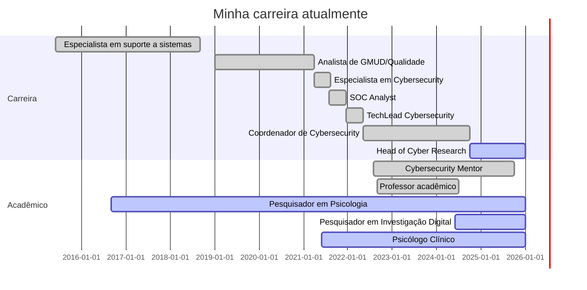

  
## Olá seja bem vindo ao meu Perfil ;)

Sou Head de Pesquisa e Cybersecurity, além de Psicólogo com especialização em Ciência das Emoções e Análise Forense do Discurso. Possuo pós-graduação em Cyber Threat Intelligence, Investigação Digital e Inteligência Cibernética. Também atuo, de forma pontual, como Mentor de Carreira em Cybersecurity.

Minha trajetória profissional combina liderança estratégica em pesquisa e preparação organizacional contra ameaças cibernéticas, com um foco sólido na detecção e neutralização de operações de segurança. Tenho experiência em análise e indicadores de Segurança da Informação, conectando essa expertise a uma atuação técnica e tática no atendimento aos clientes de SOC, sempre alinhada aos objetivos estratégicos das organizações.

Além do trabalho, tenho paixão por compartilhar conhecimento sobre segurança, tecnologia e psicologia. Participar de eventos e contribuir para a comunidade são atividades que enriquecem minha jornada pessoal e profissional.

  
**Sou também pai de pets incríveis:**

| 
 <strong>Luna</strong> Cinza, da "raça" Gapeta
 | 
 <strong>Leônidas</strong> Branco, da "raça" Gapiroto
 | 
 <strong>Dobby</strong> Caramelo, da "raça" Demônio da Pomerânia
 |
|:------------------------------------------------------------------------------------------------------------------:|:---------------------------------------------------------------------------------------------------------------------:|:-----------------------------------------------------------------------------------------------------------------:|

---
 

  Sinta-se à vontade para entrar em contato! 😊

 

  <!-- Primeira lista: Contato direto -->
  <!-- WhatsApp -->
  

  <!-- Telegram -->
  

  <!-- E-mail -->
  

 

Outras redes sociais:

 

  <!-- Segunda lista: Outras redes sociais -->
  <!-- YouTube -->
  

  <!-- Instagram -->
  

  <!-- LinkedIn -->
  

  <!-- GitHub -->
  

  <!-- Medium -->
  

  <!-- Twitter (X) -->
  

 

Habilidades que estou desenvolvendo neste momento:

 

  <!-- Python -->
  

  <!-- AI -->
  

  <!-- JavaScript -->
  

 

IDEs favoritas

 
  
  <!-- Notion -->
  

  <!-- Notepad++ -->
  

  <!-- Visual Studio -->
  

  <!-- BlackBox -->
  

  <!-- ChatGPT -->
  

  <!-- PyCharm -->
  

  

---

## **Carreira**

### **Profissional**
- **Head of Cyber Research** - (desde 10/2024)
- **Coordenador de Cybersecurity** - (05/2022 a 10/2024)
- **TechLead Cybersecurity** - (12/2021 a 05/2022)
- **SOC Analyst** - (08/2021 a 12/2021)
- **Especialista em Cybersecurity** - (04/2021 a 08/2021)
- **Analista de GMUD/Qualidade** - (01/2019 a 04/2021)
- **Especialista em suporte a sistemas** - (06/2015 a 09/2018)

### **Acadêmico**
- **Pesquisador em Investigação Digital** - (desde 06/2024)
- **Pesquisador em Psicologia** - (desde 09/2016)
- **Psicólogo Clínico** - (desde 06/2021)
- **Professor acadêmico** - (09/2022 a 06/2024)
- **Cybersecurity Mentor** - (08/2022 a 06/2026)

## **Formação Acadêmica**
### **Cursando**
- **Especialização em Inteligência Cibernética** - WB Educacional
- **Comportamento Não Verbal e Análise de Credibilidade** - ClueLab/FACSM Faculdade São Marcos

### **Concluídas**
- **Especialização em Investigação Digital** - WB Educacional
- **Especialização em CTI - Cyber Threat Intelligence** - Daryus
- **Bacharel em Psicologia** - Faculdade Pitágoras (FPAS)
- **MBA em Gestão de Projetos com Ênfase em Tecnologia** - Faculdade Vincit (UNICIV)
- **Graduação em Tecnologia em Redes de Computadores** - Faculdade Pitágoras (FPAS)
- **Técnico em Informática** - Faculdade Pitágoras (FPAS)

### **Trancadas**
- **Psicologia Fenomenológica-Existencial** - (2021) - Faveni 
- **Criminal Profiling** - (2022) - Blue Ead
- **Psicanálise e Clínica Contemporânea: Sujeito, Sofrimento e Intervenções** - (2023) - IPOG

---

## **Pesquisas e Estudos**

- **Pesquisa em Nomofobia (Vício em tecnologia)** - 2017  
- **Estudo sobre Ansiedade e a Impossibilidade de Ação na Psicanálise: Uma Análise da Neurose Obsessiva** - 2018-2021  
- **Estudo sobre a Ciência das Emoções** - 2021  
- **Pesquisa sobre Burnout e Estresse: Impactos Psicológicos e Físicos no Indivíduo** - 2022  
- **Pesquisa sobre análise de perfilamento indireto da personalidade** - 2024  

---
  
### Certificações em Andamento
- **AWS (Amazon Web Services)**
- **CTIA (Certified Threat Intelligence Analyst)**
- **ECIH (EC-Council Certified Incident Handler)**
### Cursos em Andamento
- **Curso de Inteligência e Investigação em Fontes Abertas – OSINT** - *WB - WebEducacional* - 10ª Edição, 30 horas (Cursando)
- **Análise Forense de Malware** - *AFD - Academia Forense Digital* - 40 horas (Cursando)
- **Threat Intelligence** - *AFD - Academia Forense Digital* - 40 horas (Cursando)
- **Investigação de Ataques Ransomware** - *AFD - Academia Forense Digital* - 10 horas (Cursando)
- **Resposta a Incidentes** - *AFD - Academia Forense Digital* - 40 horas (Ago/2023)
- **Masterclass Osint for Cyberwarfare** - *Lobo Inteligência* - 10 horas (Ago/2023)

---

  <a href="https:/https://github.com/Ridd1kulusC0d3r/">
  
  

---

|  |  |  |
| :-: | :-: | :-: |

|  |  |
| :-: | :-: |

---

## 🐍 Snake Game no GitHub!

Veja o Snake Game interagindo com o padrão de contribuições no meu perfil:

