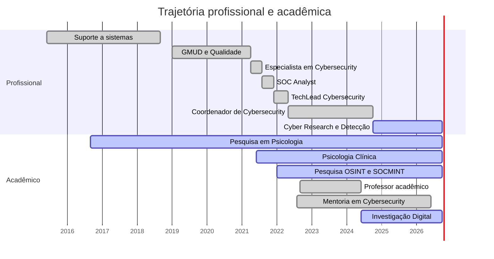

# Deivison Lourenço

**Cyber Threat Intelligence · OSINT & SOCMINT · Engenharia de Detecção**

Head de Pesquisa & Inovação na Clavis Segurança da Informação  
Mestrando em Engenharia de Software na CESAR School · Psicólogo

[Sobre](#sobre) · [Projetos](#projetos) · [Arsenal](#arsenal) · [Formação](#formação-acadêmica) · [Pesquisas](#pesquisas-e-estudos) · [Carreira](#carreira) · [Contato](#contato)

---

## Sobre

Sou pesquisador sênior em Cybersecurity, com foco em **Threat Intelligence, OSINT e engenharia de detecção**. Como Head de Pesquisa & Inovação na Clavis Segurança da Informação, lidero pesquisa aplicada para apoiar a preparação das organizações contra ameaças cibernéticas.

Conecto pesquisa à operação: transformo dados de fontes abertas e indicadores de segurança em inteligência para orientar a detecção, a resposta e as decisões do SOC. Desenvolvo frameworks e ferramentas de OSINT e modelagem de ameaças, com foco em soluções simples, auditáveis e reproduzíveis, alinhadas ao contexto de cada organização.

Mais sobre minha trajetória

Sou pós-graduado em Cyber Threat Intelligence e Investigação Digital e curso o **Mestrado Profissional em Engenharia de Software na CESAR School**, com pesquisa voltada à detecção. Compartilho conhecimento em palestras e iniciativas como H2HC, BSides, Campus Party e Osintomático, além de atuar pontualmente com mentoria de carreira em Cybersecurity.

Minha formação em Psicologia, com especialização em Ciência das Emoções e Análise Forense do Discurso, sustenta minha abordagem da **“Camada 8”**: o fator humano na segurança. Investigo comportamento de adversários, engenharia social e narrativas, com atenção ao contexto, às evidências e aos limites de interpretação.

---

## Projetos

### 01 · OSINT
**Investigação em fontes abertas**

Guia de estudos, referências e scripts para explorar técnicas de coleta e análise.  
`Material de estudo e experimentação`

[Explorar o repositório →](https://github.com/Ridd1kulusC0d3r/OSINT)

### 02 · Cyber Threat Context Modeling
**Contexto para modelagem de ameaças**

Recursos de estudo sobre atores, cenários de ataque e modelagem de ameaças.  
`Curadoria de recursos`

[Explorar os materiais →](https://github.com/Ridd1kulusC0d3r/Cyber-Threat-Context-Modeling)

### 03 · Palestras
**Segurança, investigação e comportamento humano**

Apresentações e materiais para compartilhar conhecimento com a comunidade.  
`Acervo de apresentações`

[Ver apresentações →](https://github.com/Ridd1kulusC0d3r/Palestras)

**Mais conteúdo:** [OsintUAI — episódios e entrevistas](https://github.com/Ridd1kulusC0d3r/OsintUAI) · [Todos os repositórios](https://github.com/Ridd1kulusC0d3r?tab=repositories)

---

## Arsenal

| Área | Prática e ferramentas |
|---|---|
| **⌕ Inteligência** | Threat Intelligence · OSINT · SOCMINT · Modelagem de ameaças |
| **◇ Detecção** | Engenharia de detecção · Análise de indicadores · Apoio à operação do SOC |
| **⌘ Linguagens** | Python · Go · JavaScript — estudos e desenvolvimento |
| **◈ IA aplicada** | Pesquisa e enriquecimento de dados, com revisão humana e rastreabilidade |
| **▤ Ambiente de trabalho** |     |
| **↗ Projetos** | [OSINT](https://github.com/Ridd1kulusC0d3r/OSINT) · [Cyber Threat Context Modeling](https://github.com/Ridd1kulusC0d3r/Cyber-Threat-Context-Modeling) · [OsintUAI](https://github.com/Ridd1kulusC0d3r/OsintUAI) |

---

## Formação acadêmica

> **Mestrado Profissional em Engenharia de Software**  
> CESAR School · Em andamento  
> Pesquisa voltada à detecção.

Pós-graduações em andamento

| Formação | Instituição | Situação |
|---|---|---|
| **Pós-Graduação em Inteligência Cibernética** | WB Educacional | Em andamento |
| **Pós-Graduação em Inteligência e Enfrentamento ao Crime Organizado** | WB Educacional | Em andamento |
| **Pós-Graduação em Inteligência e Investigação em Fontes Abertas (OSINT)** | WB Educacional | Em andamento |
| **Pós-Graduação em Investigação de Crimes Cibernéticos** | WB Educacional | Em andamento |
| **Pós-Graduação em Análise de Inteligência Avançada** | WB Educacional | Em andamento |

Formações concluídas

| Formação | Instituição | Situação |
|---|---|---|
| **Especialização em Investigação Digital** | WB Educacional | Concluída |
| **Especialização em Cyber Threat Intelligence (CTI)** | Daryus | Concluída |
| **Comportamento Não Verbal e Análise de Credibilidade** | ClueLab/FACSM Faculdade São Marcos | Concluída |
| **Bacharelado em Psicologia** | Faculdade Pitágoras (FPAS) | Concluída |
| **MBA em Gestão de Projetos com Ênfase em Tecnologia** | Faculdade Vincit (UNICIV) | Concluída |
| **Graduação em Tecnologia em Redes de Computadores** | Faculdade Pitágoras (FPAS) | Concluída |
| **Técnico em Informática** | Faculdade Pitágoras (FPAS) | Concluída |

Formações trancadas

| Formação | Instituição | Situação |
|---|---|---|
| **Psicologia Fenomenológica-Existencial** | Faveni (2021) | Trancada |
| **Criminal Profiling** | Blue Ead (2022) | Trancada |
| **Psicanálise e Clínica Contemporânea: Sujeito, Sofrimento e Intervenções** | IPOG (2023) | Trancada |

---

## Pesquisas e estudos

### 2026 · T.O.C.A.I.A.
Framework de inteligência OSINT comportamental.

### 2025 · SOCMINT
Mapeamento de padrões comportamentais em redes sociais.

### 2024 · Perfilamento indireto
Análise de perfilamento indireto da personalidade.

*Os materiais públicos dessas três pesquisas ainda não estão vinculados neste perfil.*

Ver outras pesquisas e estudos

| Ano | Tema |
|---|---|
| **2023** | Threat Intelligence e arquitetura de modelagem de ameaças |
| **2022** | Burnout e estresse: impactos psicológicos e físicos no indivíduo |
| **2021** | Ciência das Emoções |
| **2018–2021** | Ansiedade e a impossibilidade de ação na psicanálise: uma análise da neurose obsessiva |
| **2017** | Nomofobia |

---

## Carreira

<strong>Ver trajetória profissional, acadêmica e linha do tempo</strong>

### Profissional

| Atuação | Período |
|---|---|
| **Head of Cyber Research & Threat Detection Engineering** | Desde 10/2024 |
| **Coordenador de Cybersecurity** | 05/2022–10/2024 |
| **TechLead Cybersecurity** | 12/2021–05/2022 |
| **SOC Analyst** | 08/2021–12/2021 |
| **Especialista em Cybersecurity** | 04/2021–08/2021 |
| **Analista de GMUD/Qualidade** | 01/2019–04/2021 |
| **Especialista em suporte a sistemas** | 06/2015–09/2018 |

### Acadêmico

| Atuação | Período |
|---|---|
| **Pesquisador em Investigação Digital** | Desde 06/2024 |
| **Pesquisador em OSINT e SOCMINT** | Desde 01/2022 |
| **Pesquisador em Psicologia** | Desde 09/2016 |
| **Psicólogo Clínico** | Desde 06/2021 |
| **Professor acadêmico** | 09/2022–06/2024 |
| **Cybersecurity Mentor** | 08/2022–06/2026 |

### Linha do tempo

```mermaid
gantt
    title Trajetória profissional e acadêmica
    dateFormat YYYY-MM-DD
    axisFormat %Y
    section Profissional
    Suporte a sistemas :done, 2015-06-01, 2018-09-01
    GMUD e Qualidade :done, 2019-01-01, 2021-04-01
    Especialista em Cybersecurity :done, 2021-04-01, 2021-08-01
    SOC Analyst :done, 2021-08-01, 2021-12-01
    TechLead Cybersecurity :done, 2021-12-01, 2022-05-01
    Coordenador de Cybersecurity :done, 2022-05-01, 2024-10-01
    Cyber Research e Detecção :active, 2024-10-01, 2026-09-26
    section Acadêmico
    Pesquisa em Psicologia :active, 2016-09-01, 2026-09-26
    Psicologia Clínica :active, 2021-06-01, 2026-09-26
    Pesquisa OSINT e SOCMINT :active, 2022-01-01, 2026-09-26
    Professor acadêmico :done, 2022-09-01, 2024-06-01
    Mentoria em Cybersecurity :done, 2022-08-01, 2026-06-01
    Investigação Digital :active, 2024-06-01, 2026-09-26
```

*Atividades em andamento representadas até 26/09/2026; essa data não indica encerramento.*

---

## Desenvolvimento profissional

<strong>Ver certificações e cursos</strong>

### Certificações em andamento

| Certificação | Nome |
|---|---|
| **T&#124;IE** | Threat Intelligence Essentials |
| **C&#124;TIA** | Certified Threat Intelligence Analyst |
| **E&#124;CIH** | EC-Council Certified Incident Handler |
| **PORP OSINT** | PORP OSINT |

### Cursos

| Curso | Instituição | Carga horária | Situação / referência |
|---|---|---|---|
| **Inteligência e Investigação em Fontes Abertas — OSINT** | WB / WebEducacional | 30 h | Em andamento · 10ª edição |
| **Análise Forense de Malware** | AFD / Academia Forense Digital | 40 h | Em andamento |
| **Threat Intelligence** | AFD / Academia Forense Digital | 40 h | Em andamento |
| **Investigação de Ataques Ransomware** | AFD / Academia Forense Digital | 10 h | Em andamento |
| **Resposta a Incidentes** | AFD / Academia Forense Digital | 40 h | Histórico informado · 08/2023 |
| **Masterclass OSINT for Cyberwarfare** | Lobo Inteligência | 10 h | Histórico informado · 08/2023 |

---

## Idiomas

**Português** — Nativo · **Inglês** — Básico/intermediário  
**Espanhol** — Intermediário/Avançado · **Russo** — Básico

---

## Contato

**Redes sociais**

---

## Atividade no GitHub

  

  
  

<strong>▥ Ver histórico e gráficos de atividade</strong>

 

  

  

  

