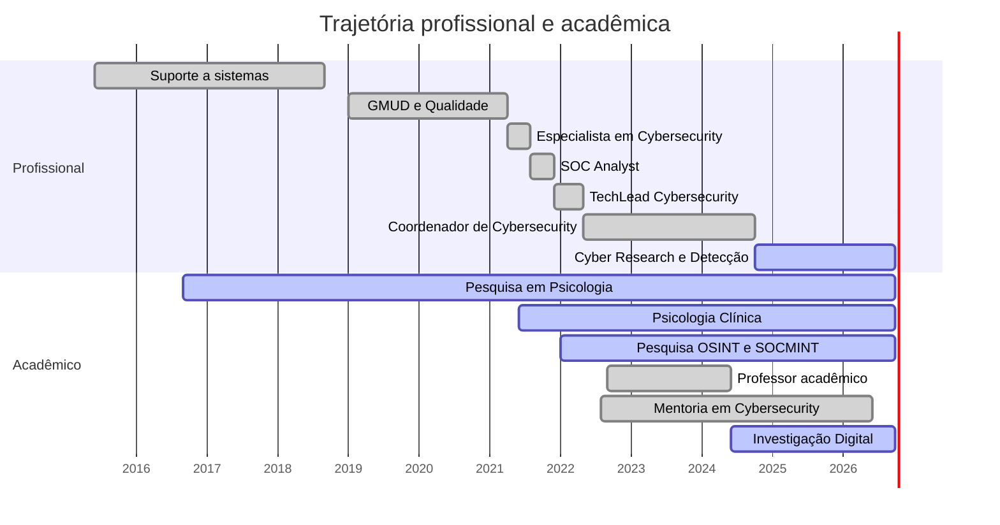

# Deivison Lourenço

**Cyber Threat Intelligence · OSINT & SOCMINT · Engenharia de Detecção**

Head de Pesquisa & Inovação na Clavis Segurança da Informação  
Mestrando em Engenharia de Software na CESAR School · Psicólogo

[Projetos](#projetos) · [Sobre](#sobre) · [Pesquisas](#pesquisas-e-estudos) · [Formação](#formação-acadêmica) · [Carreira](#carreira) · [Contato](#contato)

---

## Projetos

| Projeto | Foco | Conteúdo disponível |
|---|---|---|
| [OSINT](https://github.com/Ridd1kulusC0d3r/OSINT) | Investigação em fontes abertas | Guia de estudos, referências e scripts |
| [Cyber Threat Context Modeling](https://github.com/Ridd1kulusC0d3r/Cyber-Threat-Context-Modeling) | Modelagem de ameaças | Materiais e recursos de estudo |
| [OsintUAI](https://github.com/Ridd1kulusC0d3r/OsintUAI) | Compartilhamento de conhecimento | Links de episódios e entrevistas |
| [Palestras](https://github.com/Ridd1kulusC0d3r/Palestras) | Segurança e comportamento humano | Apresentações e materiais |

[Explorar todos os repositórios →](https://github.com/Ridd1kulusC0d3r?tab=repositories)

---

## Sobre

Sou pesquisador sênior em Cybersecurity, com foco em **Threat Intelligence, OSINT e engenharia de detecção**. Como Head de Pesquisa & Inovação na Clavis Segurança da Informação, lidero pesquisa aplicada para apoiar a preparação das organizações contra ameaças cibernéticas.

Conecto pesquisa à operação: transformo dados de fontes abertas e indicadores de segurança em inteligência para orientar a detecção, a resposta e as decisões do SOC. Desenvolvo frameworks e ferramentas de OSINT e modelagem de ameaças, com foco em soluções simples, auditáveis e reproduzíveis, alinhadas ao contexto de cada organização.

Sou pós-graduado em Cyber Threat Intelligence e Investigação Digital e curso o **Mestrado Profissional em Engenharia de Software na CESAR School**, com pesquisa voltada à detecção. Compartilho conhecimento em palestras e iniciativas como H2HC, BSides, Campus Party e Osintomático, além de atuar pontualmente com mentoria de carreira em Cybersecurity.

Minha formação em Psicologia, com especialização em Ciência das Emoções e Análise Forense do Discurso, sustenta minha abordagem da **“Camada 8”**: o fator humano na segurança. Investigo comportamento de adversários, engenharia social e narrativas, com atenção ao contexto, às evidências e aos limites de interpretação.

---

## Pesquisas e estudos

| Ano | Tema |
|---|---|
| **2026** | **T.O.C.A.I.A.** — framework de inteligência OSINT comportamental |
| **2025** | Mapeamento de padrões comportamentais em redes sociais — SOCMINT |
| **2024** | Análise de perfilamento indireto da personalidade |
| **2023** | Threat Intelligence e arquitetura de modelagem de ameaças |
| **2022** | Burnout e estresse: impactos psicológicos e físicos no indivíduo |
| **2021** | Ciência das Emoções |
| **2018–2021** | Ansiedade e a impossibilidade de ação na psicanálise: uma análise da neurose obsessiva |
| **2017** | Nomofobia |

---

## Formação acadêmica

### Cursando

- **Mestrado Profissional em Engenharia de Software (MPES)** — CESAR School
- **Pós-Graduação em Inteligência Cibernética** — WB Educacional
- **Pós-Graduação em Inteligência e Enfrentamento ao Crime Organizado** — WB Educacional
- **Pós-Graduação em Inteligência e Investigação em Fontes Abertas (OSINT)** — WB Educacional
- **Pós-Graduação em Investigação de Crimes Cibernéticos** — WB Educacional
- **Pós-Graduação em Análise de Inteligência Avançada** — WB Educacional

### Concluídas

- **Especialização em Investigação Digital** — WB Educacional
- **Especialização em Cyber Threat Intelligence (CTI)** — Daryus
- **Comportamento Não Verbal e Análise de Credibilidade** — ClueLab/FACSM Faculdade São Marcos
- **Bacharelado em Psicologia** — Faculdade Pitágoras (FPAS)
- **MBA em Gestão de Projetos com Ênfase em Tecnologia** — Faculdade Vincit (UNICIV)
- **Graduação em Tecnologia em Redes de Computadores** — Faculdade Pitágoras (FPAS)
- **Técnico em Informática** — Faculdade Pitágoras (FPAS)

Formações trancadas

- **Psicologia Fenomenológica-Existencial** — Faveni (2021)
- **Criminal Profiling** — Blue Ead (2022)
- **Psicanálise e Clínica Contemporânea: Sujeito, Sofrimento e Intervenções** — IPOG (2023)

---

## Carreira

<strong>Ver trajetória profissional, acadêmica e linha do tempo</strong>

### Profissional

| Atuação | Período |
|---|---|
| **Head of Cyber Research & Threat Detection Engineering** | Desde 10/2024 |
| **Coordenador de Cybersecurity** | 05/2022–10/2024 |
| **TechLead Cybersecurity** | 12/2021–05/2022 |
| **SOC Analyst** | 08/2021–12/2021 |
| **Especialista em Cybersecurity** | 04/2021–08/2021 |
| **Analista de GMUD/Qualidade** | 01/2019–04/2021 |
| **Especialista em suporte a sistemas** | 06/2015–09/2018 |

### Acadêmico

| Atuação | Período |
|---|---|
| **Pesquisador em Investigação Digital** | Desde 06/2024 |
| **Pesquisador em OSINT e SOCMINT** | Desde 01/2022 |
| **Pesquisador em Psicologia** | Desde 09/2016 |
| **Psicólogo Clínico** | Desde 06/2021 |
| **Professor acadêmico** | 09/2022–06/2024 |
| **Cybersecurity Mentor** | 08/2022–06/2026 |

### Linha do tempo

```mermaid
gantt
    title Trajetória profissional e acadêmica
    dateFormat YYYY-MM-DD
    axisFormat %Y
    section Profissional
    Suporte a sistemas :done, 2015-06-01, 2018-09-01
    GMUD e Qualidade :done, 2019-01-01, 2021-04-01
    Especialista em Cybersecurity :done, 2021-04-01, 2021-08-01
    SOC Analyst :done, 2021-08-01, 2021-12-01
    TechLead Cybersecurity :done, 2021-12-01, 2022-05-01
    Coordenador de Cybersecurity :done, 2022-05-01, 2024-10-01
    Cyber Research e Detecção :active, 2024-10-01, 2026-09-26
    section Acadêmico
    Pesquisa em Psicologia :active, 2016-09-01, 2026-09-26
    Psicologia Clínica :active, 2021-06-01, 2026-09-26
    Pesquisa OSINT e SOCMINT :active, 2022-01-01, 2026-09-26
    Professor acadêmico :done, 2022-09-01, 2024-06-01
    Mentoria em Cybersecurity :done, 2022-08-01, 2026-06-01
    Investigação Digital :active, 2024-06-01, 2026-09-26
```

*Atividades em andamento representadas até 26/09/2026; essa data não indica encerramento.*

---

## Desenvolvimento profissional

<strong>Ver certificações e cursos</strong>

### Certificações em andamento

- **T|IE** — Threat Intelligence Essentials
- **C|TIA** — Certified Threat Intelligence Analyst
- **E|CIH** — EC-Council Certified Incident Handler
- **PORP OSINT**

### Em andamento

- **Inteligência e Investigação em Fontes Abertas — OSINT** — WB / WebEducacional · 10ª edição · 30 horas
- **Análise Forense de Malware** — AFD / Academia Forense Digital · 40 horas
- **Threat Intelligence** — AFD / Academia Forense Digital · 40 horas
- **Investigação de Ataques Ransomware** — AFD / Academia Forense Digital · 10 horas

### Histórico informado

- **Resposta a Incidentes** — AFD / Academia Forense Digital · 40 horas · 08/2023
- **Masterclass OSINT for Cyberwarfare** — Lobo Inteligência · 10 horas · 08/2023

---

## Tecnologias e aprendizado

Estudos e desenvolvimento em **Python, Go e JavaScript**, com interesse em **IA aplicada à pesquisa, ao enriquecimento de dados e ao apoio à análise de inteligência**, mantendo revisão humana e rastreabilidade das fontes.

### Ambiente de trabalho e organização

[Notion](https://www.notion.so/) · [Notepad++](https://notepad-plus-plus.org/) · [Obsidian](https://obsidian.md/) · [Visual Studio Code](https://code.visualstudio.com/)

---

## Contato

**Redes sociais:** [LinkedIn](https://www.linkedin.com/in/deivisonlourencos/) · [Instagram](https://www.instagram.com/deivisonlourencos)

---

## Atividade no GitHub

  
   
  

| Estatísticas | Linguagens por repositório | Linguagens por commit |
|:---:|:---:|:---:|
|  |  |  |

  
   
  

