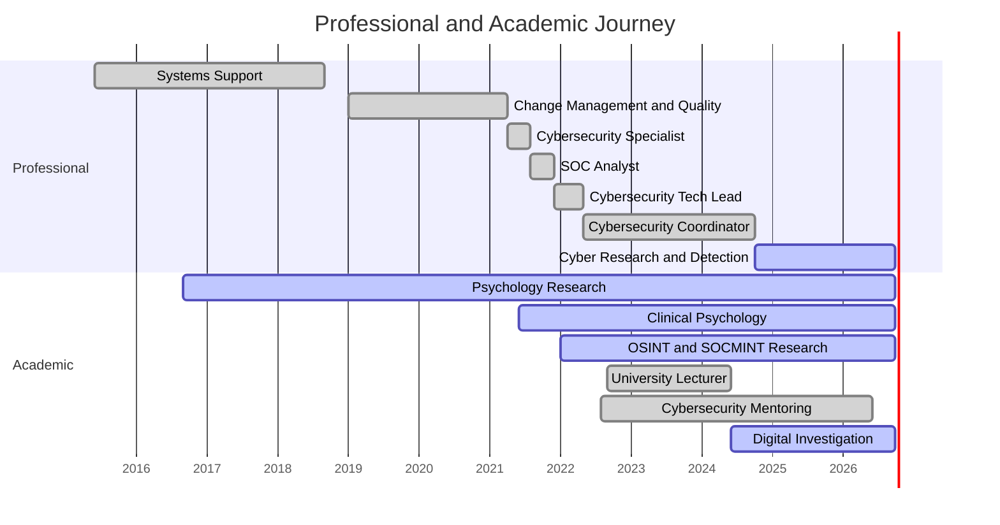

<!-- LANGUAGE_SELECTOR_START -->

  <samp>
    <strong>English</strong> ·
    <a href="./README.pt-BR.md">Português</a> ·
    <a href="./README.es.md">Español</a> ·
    <a href="./README.ru.md">Русский</a>
  </samp>

<!-- LANGUAGE_SELECTOR_END -->

# Deivison Lourenço

**Cyber Threat Intelligence · OSINT & SOCMINT · Detection Engineering · Digital Investigation · Threat Modeling · Behavioral OSINT**

Head of Research & Innovation at Clavis Segurança da Informação  
Professional Master's student in Software Engineering at CESAR School · Psychologist

<samp>
<a href="#about">about</a> ·
<a href="#projects">projects</a> ·
<a href="#research">research</a> ·
<a href="https://github.com/Ridd1kulusC0d3r/T4lks">talks</a> ·
<a href="https://github.com/Ridd1kulusC0d3r/OsintUAI">podcast</a> ·
<a href="https://www.linkedin.com/in/deivisonlourencos/">linkedin</a> ·
<a href="https://www.instagram.com/deivisonlourencos/">instagram</a> ·
<a href="mailto:deivsec@gmail.com">email</a>
</samp>

---

## About

I am a senior cybersecurity researcher focused on **Threat Intelligence, OSINT, and Detection Engineering**. As Head of Research & Innovation at Clavis Segurança da Informação, I lead applied research to help organizations prepare for cyber threats.

I connect research with operations by turning open-source data and security indicators into intelligence that supports detection, incident response, and SOC decision-making. I develop OSINT and threat-modeling frameworks and tools with an emphasis on simple, auditable, and reproducible solutions tailored to organizational context.

More about my background

I hold postgraduate qualifications in Cyber Threat Intelligence and Digital Investigation and am currently pursuing a **Professional Master's in Software Engineering at CESAR School**, with research focused on detection. I share knowledge through talks and initiatives such as H2HC, BSides, Campus Party, and Osintomático, and have also worked as a cybersecurity career mentor.

My background in Psychology, together with studies in the Science of Emotions and Forensic Discourse Analysis, supports my **"Layer 8"** approach: the human factor in cybersecurity. I research adversary behavior, social engineering, and narratives, with close attention to context, evidence, and the limits of interpretation.

---

## Projects

<strong>View featured projects</strong>

### 01 · OSINT
**Open-source investigation**

Study guides, references, and scripts for exploring collection and analysis techniques.  
`Study and experimentation material`

[Explore the repository →](https://github.com/Ridd1kulusC0d3r/OSINT)

### 02 · Cyber Threat Context Modeling
**Context-driven threat modeling**

Study resources on threat actors, attack scenarios, and threat modeling.  
`Curated resources`

[Explore the materials →](https://github.com/Ridd1kulusC0d3r/Cyber-Threat-Context-Modeling)

### 03 · Talks
**Security, investigation, and human behavior**

Presentations and supporting material created to share knowledge with the community.  
`Talks and presentation archive`

[View talks →](https://github.com/Ridd1kulusC0d3r/T4lks)

**More:** [OsintUAI — episodes and interviews](https://github.com/Ridd1kulusC0d3r/OsintUAI) · [All repositories](https://github.com/Ridd1kulusC0d3r?tab=repositories)

---

## Toolkit

<strong>View technical toolkit</strong>

| Area | Practice & Tools |
|---|---|
| **⌕ Intelligence** | Threat Intelligence · OSINT · SOCMINT · Threat Modeling |
| **◇ Detection** | Detection Engineering · Indicator Analysis · SOC Operations Support |
| **⌘ Languages** | Python · Go · JavaScript — study and development |
| **◈ Applied AI** | Research and data enrichment with human review and traceability |
| **▤ Workspace** |     |
| **↗ Projects** | [OSINT](https://github.com/Ridd1kulusC0d3r/OSINT) · [Cyber Threat Context Modeling](https://github.com/Ridd1kulusC0d3r/Cyber-Threat-Context-Modeling) · [OsintUAI](https://github.com/Ridd1kulusC0d3r/OsintUAI) |

---

## Education & Certifications

> **Professional Master's in Software Engineering**  
> CESAR School · In progress  
> Research focused on detection.

<strong>View full education, certifications, and courses</strong>

### Postgraduate programs in progress

| Program | Institution | Status |
|---|---|---|
| **Postgraduate Program in Cyber Intelligence** | WB Educacional | In progress |
| **Postgraduate Program in Intelligence and Countering Organized Crime** | WB Educacional | In progress |
| **Postgraduate Program in Open-Source Intelligence and Investigation (OSINT)** | WB Educacional | In progress |
| **Postgraduate Program in Cybercrime Investigation** | WB Educacional | In progress |
| **Postgraduate Program in Advanced Intelligence Analysis** | WB Educacional | In progress |

### Completed education

| Program | Institution | Status |
|---|---|---|
| **Specialization in Digital Investigation** | WB Educacional | Completed |
| **Specialization in Cyber Threat Intelligence (CTI)** | Daryus | Completed |
| **Nonverbal Behavior and Credibility Analysis** | ClueLab/FACSM Faculdade São Marcos | Completed |
| **Bachelor's Degree in Psychology** | Faculdade Pitágoras (FPAS) | Completed |
| **MBA in Project Management with Emphasis in Technology** | Faculdade Vincit (UNICIV) | Completed |
| **Technology Degree in Computer Networks** | Faculdade Pitágoras (FPAS) | Completed |
| **Technical Diploma in Information Technology** | Faculdade Pitágoras (FPAS) | Completed |

### Paused studies

| Program | Institution | Status |
|---|---|---|
| **Existential-Phenomenological Psychology** | Faveni (2021) | Paused |
| **Criminal Profiling** | Blue Ead (2022) | Paused |
| **Psychoanalysis and Contemporary Clinical Practice: Subject, Suffering, and Interventions** | IPOG (2023) | Paused |

### Certifications in progress

| Certification | Name |
|---|---|
| **T&#124;IE** | Threat Intelligence Essentials |
| **C&#124;TIA** | Certified Threat Intelligence Analyst |
| **E&#124;CIH** | EC-Council Certified Incident Handler |
| **PORP OSINT** | PORP OSINT |

### Courses

| Course | Institution | Workload | Status / Reference |
|---|---|---|---|
| **Open-Source Intelligence and Investigation — OSINT** | WB / WebEducacional | 30 h | In progress · 10th edition |
| **Malware Forensics** | AFD / Academia Forense Digital | 40 h | In progress |
| **Threat Intelligence** | AFD / Academia Forense Digital | 40 h | In progress |
| **Ransomware Attack Investigation** | AFD / Academia Forense Digital | 10 h | In progress |
| **Incident Response** | AFD / Academia Forense Digital | 40 h | Previously completed · 08/2023 |
| **OSINT for Cyberwarfare Masterclass** | Lobo Inteligência | 10 h | Previously completed · 08/2023 |

---

## Research & Studies

<strong>View research and study areas</strong>

### 2026 · T.O.C.A.I.A.
Behavioral OSINT intelligence framework.

### 2025 · SOCMINT
Mapping behavioral patterns across social networks.

### 2024 · Indirect Profiling
Analysis of indirect personality profiling.

*Public materials for these three research lines are not yet linked from this profile.*

View additional research and studies

| Year | Topic |
|---|---|
| **2023** | Threat Intelligence and threat-modeling architecture |
| **2022** | Burnout and stress: psychological and physical impacts on the individual |
| **2021** | Science of Emotions |
| **2018–2021** | Anxiety and the impossibility of action in psychoanalysis: an analysis of obsessive neurosis |
| **2017** | Nomophobia |

---

## Career

<strong>View professional, academic, and career timeline</strong>

### Professional

| Role | Period |
|---|---|
| **Head of Cyber Research & Threat Detection Engineering** | Since 10/2024 |
| **Cybersecurity Coordinator** | 05/2022–10/2024 |
| **Cybersecurity Tech Lead** | 12/2021–05/2022 |
| **SOC Analyst** | 08/2021–12/2021 |
| **Cybersecurity Specialist** | 04/2021–08/2021 |
| **Change Management / Quality Analyst** | 01/2019–04/2021 |
| **Systems Support Specialist** | 06/2015–09/2018 |

### Academic

| Role | Period |
|---|---|
| **Digital Investigation Researcher** | Since 06/2024 |
| **OSINT & SOCMINT Researcher** | Since 01/2022 |
| **Psychology Researcher** | Since 09/2016 |
| **Clinical Psychologist** | Since 06/2021 |
| **University Lecturer** | 09/2022–06/2024 |
| **Cybersecurity Mentor** | 08/2022–06/2026 |

### Timeline

```mermaid
gantt
    title Professional and Academic Journey
    dateFormat YYYY-MM-DD
    axisFormat %Y
    section Professional
    Systems Support :done, 2015-06-01, 2018-09-01
    Change Management and Quality :done, 2019-01-01, 2021-04-01
    Cybersecurity Specialist :done, 2021-04-01, 2021-08-01
    SOC Analyst :done, 2021-08-01, 2021-12-01
    Cybersecurity Tech Lead :done, 2021-12-01, 2022-05-01
    Cybersecurity Coordinator :done, 2022-05-01, 2024-10-01
    Cyber Research and Detection :active, 2024-10-01, 2026-09-26
    section Academic
    Psychology Research :active, 2016-09-01, 2026-09-26
    Clinical Psychology :active, 2021-06-01, 2026-09-26
    OSINT and SOCMINT Research :active, 2022-01-01, 2026-09-26
    University Lecturer :done, 2022-09-01, 2024-06-01
    Cybersecurity Mentoring :done, 2022-08-01, 2026-06-01
    Digital Investigation :active, 2024-06-01, 2026-09-26
```

*Ongoing activities are represented through September 26, 2026; this date does not indicate an end date.*

---

## Languages

**Portuguese** — Native · **English** — Basic/Intermediate  
**Spanish** — Intermediate/Advanced · **Russian** — Basic

---
