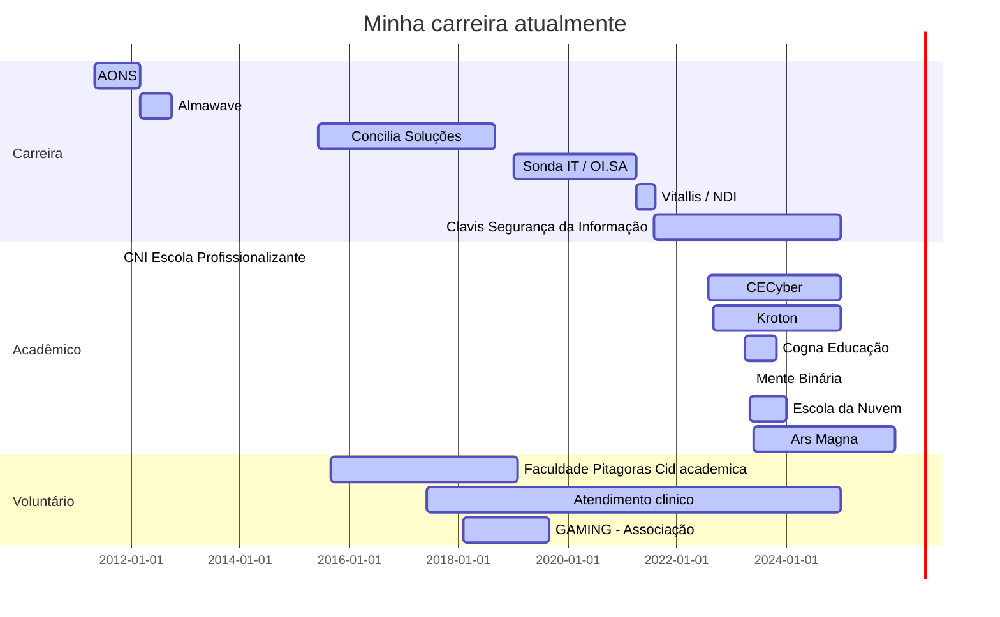

## Olá seja bem vindo ao meu Perfil ;)

Sou coordenador de Cybersecurity, Psicólogo especializado em ciêcia das emoções e analise forense do discurso, especialista em Cyber Threat Intelligence e investigação digital, Mentor de Carreira em Cybersecurity. 
Minha jornada abrange desde a liderança estratégica de Operações de Segurança, analise e indicadores de SI conectando com atuação técnica de forma tática e estratégica para com os clientes de SOC. Nas horas vagas, também gosto de escrever e compartilhar conhecimento sobre segurança e tecnologia. 
Atualmente, estou buscando expandir minha atuação para a área acadêmica e venho atuando como professor no ensino superior. Estou continuamente buscando aprimorar meus conhecimentos e habilidades para contribuir com o desenvolvimento de novos talentos no mercado.
 

 
  
  
   

### Formação Acadêmica
- **Especialização em Investigação Digital** - *WB Educacional* - Em andamento
- **Comportamento Não Verbal e Análise de Credibilidade** - *ClueLab/FACSM Faculdade São Marcos* - Em andamento
- **Especialização em CTI - Cyber Threat Intelligence** - *Daryus*
- **Bacharel em Psicologia** - *Faculdade Pitagoras (FPAS)*
- **MBA em Gestão de Projetos com Ênfase em Tecnologia** - *Faculdade Vincit (UNICIV)*
- **Graduação em Tecnologia em Redes de Computadores** - *Faculdade Pitagoras (FPAS)*
- **Técnico em Informática** - *Faculdade Pitagoras (FPAS)*
  
### Certificações em Andamento
- **AWS (Amazon Web Services)**
- **CTIA (Certified Threat Intelligence Analyst)**
- **ECIH (EC-Council Certified Incident Handler)**
### Cursos em Andamento
- **Curso de Inteligência e Investigação em Fontes Abertas – OSINT** - *WB - WebEducacional* - 10ª Edição, 30 horas (Cursando)
- **Análise Forense de Malware** - *AFD - Academia Forense Digital* - 40 horas (Cursando)
- **Threat Intelligence** - *AFD - Academia Forense Digital* - 40 horas (Cursando)
- **Investigação de Ataques Ransomware** - *AFD - Academia Forense Digital* - 10 horas (Cursando)
- **Resposta a Incidentes** - *AFD - Academia Forense Digital* - 40 horas (Ago/2023)
- **Masterclass Osint for Cyberwarfare** - *Lobo Inteligência* - 10 horas (Ago/2023)

  <a href="https:/https://github.com/Ridd1kulusC0d3r/">
  
  

    
|  |  |  |
| :-: | :-: | :-: |

|  |  |
| :-: | :-: |

